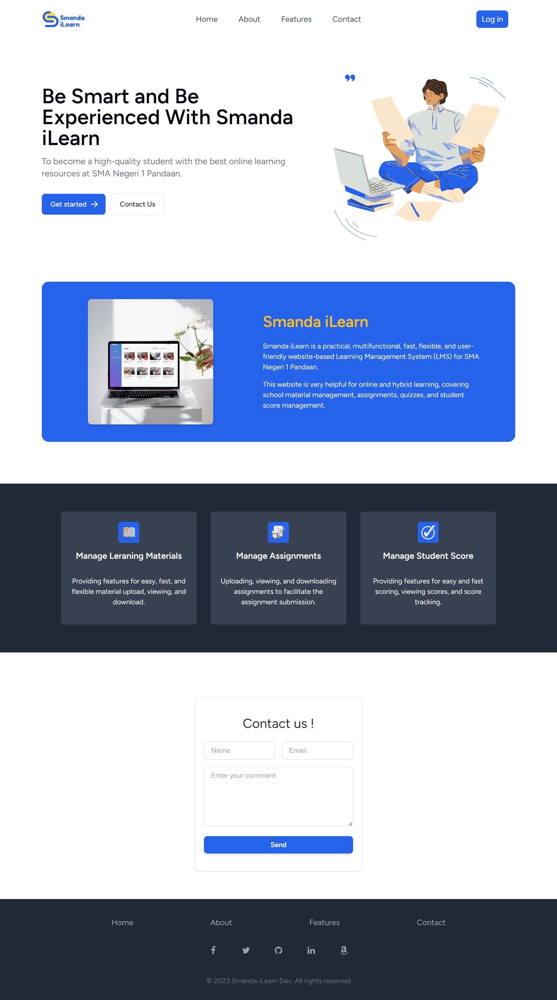
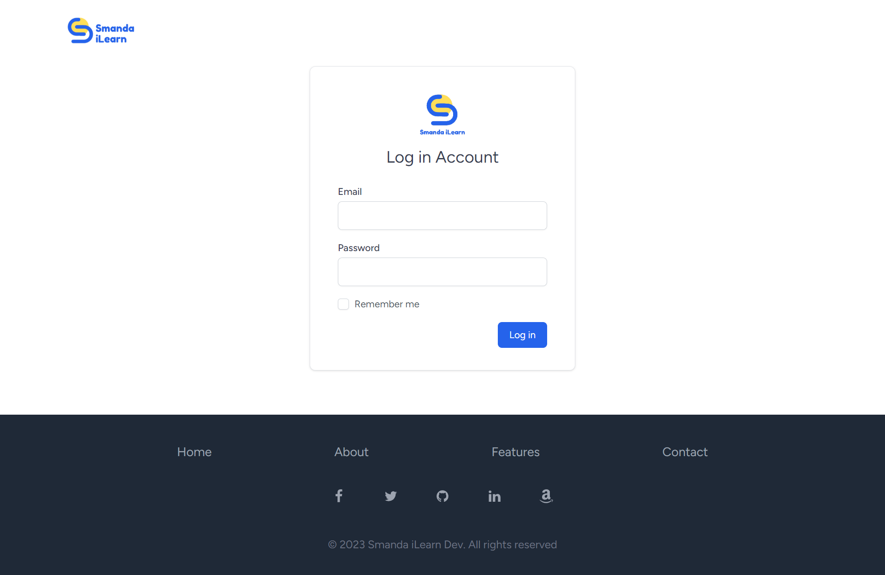
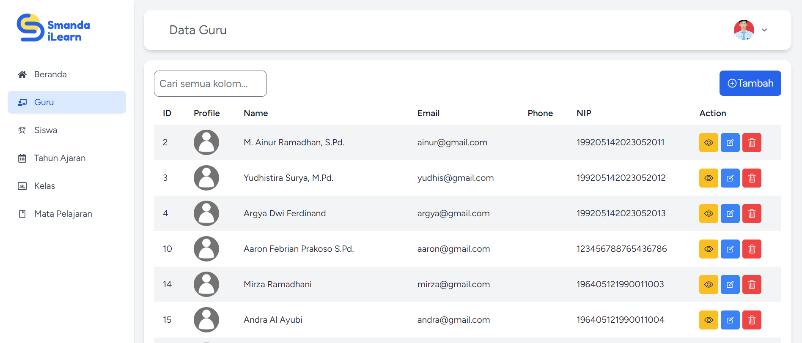
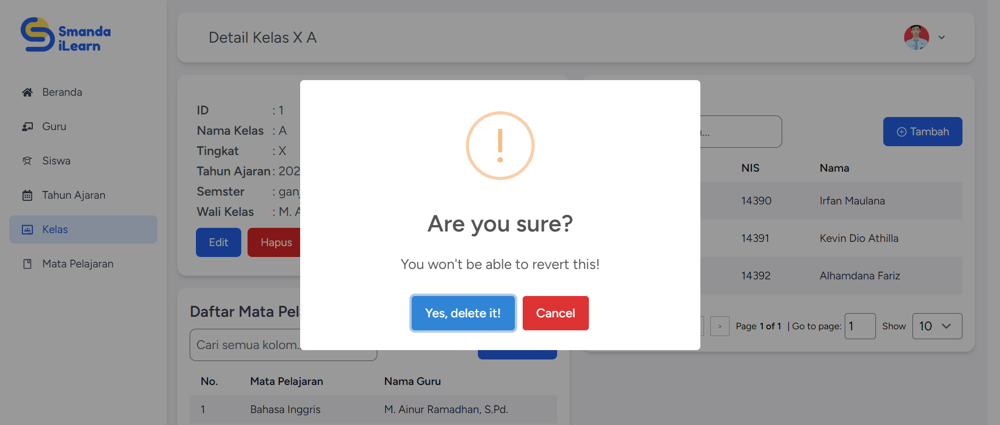
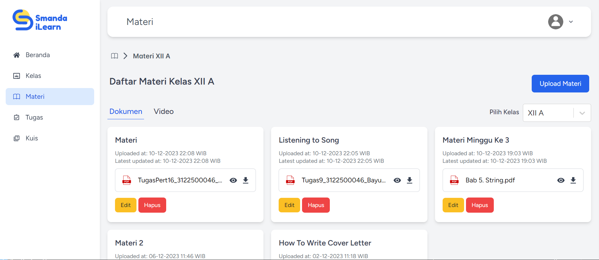
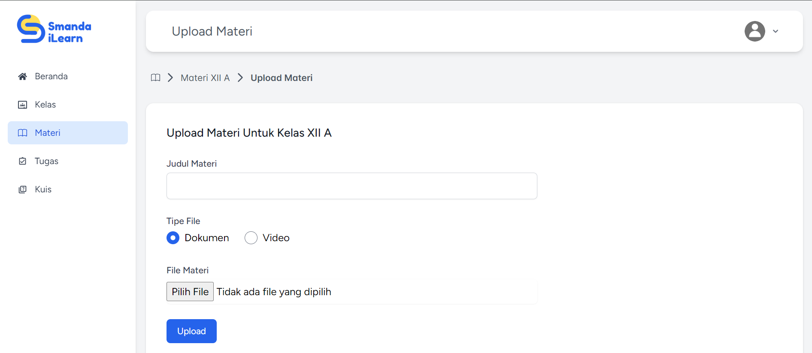
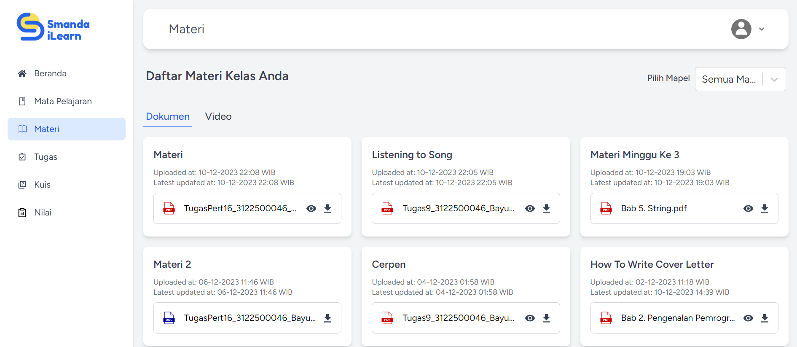
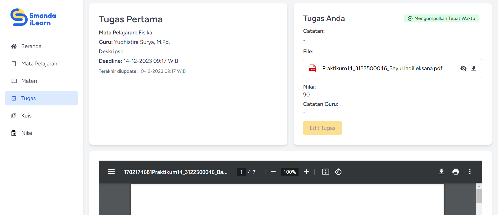
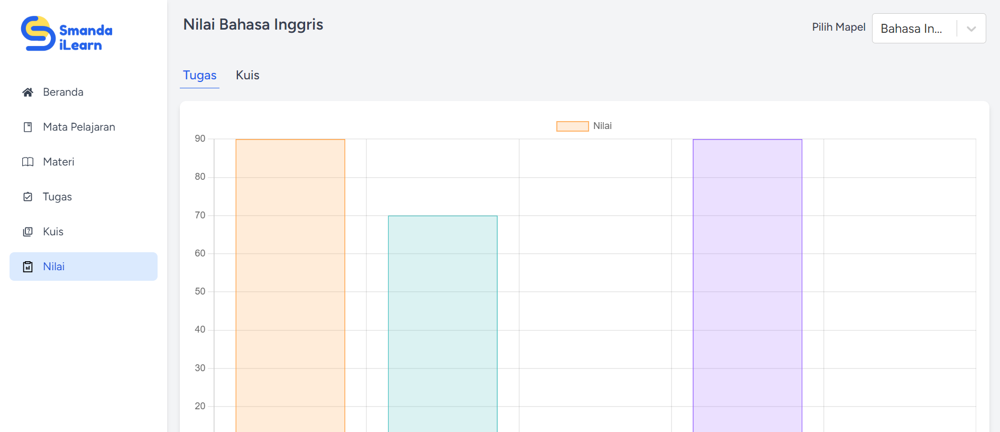

<h1 style="color: blue;">Smanda iLearn</h1>

## Live Demo

You can visit http://smandailearn.my.id   this hosting is active only for 1
month (end around 10 January 2024).

## About Smanda iLearn

Smanda iLearn is a web-based Learning Management System application. This
application was created as part of my final project for the Web-Based
Application Workshop course at the Politeknik Elektronika Negeri Surabaya. The
purpose of this application is to manage (upload, view, download, and perform
CRUD operations on) learning materials, assignments, quizzes, and grades. For
this project, the target is set for SMAN 1 Pandaan, Pasuruan, which is the high
school I attended. Nevertheless, this application can be used for high schools,
junior high schools, or elementary schools anywhere.

## Landing Page and Login Page

 

## Role

This application has users with various roles, namely administrator (admin),
teacher, and student.

- Admin         The
  admin is responsible for managing the main data of the application, such as
  teacher data, student data, subjects, academic years, and class data,
  including class teachers, students, and subjects within each class.   Admin
  account in this application:   email: bayuhadi863@gmail.com   password:
  12345678

- Teacher        
  Teachers are responsible for uploading materials, uploading assignments,
  creating quizzes, and providing grades. In addition, teachers can also view
  uploaded material or assignment files and perform actions such as deletion and
  other CRUD processes.   Example of teacher account in this application:
    email: ainur@gmail.com   password: RHSmau123

- Student        
     Students have access to view materials,
  assignments, and grades. Additionally, they can submit assignments by
  uploading their submission files. They can also download files uploaded by
  teachers.   Example of student account in this application:   email:
  irfan@gmail.com   password: RHSmau123
